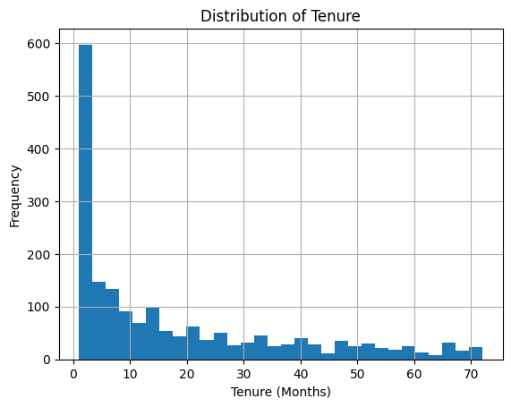
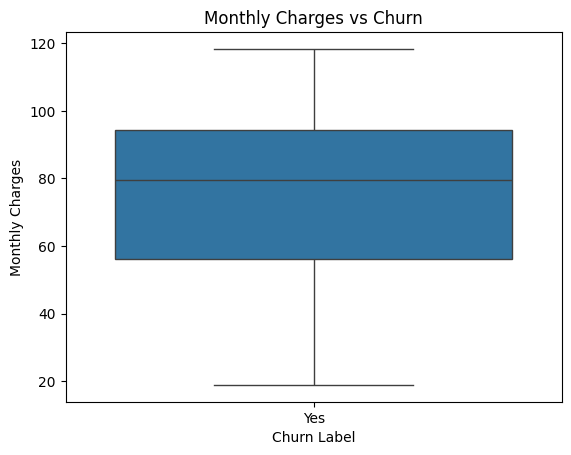
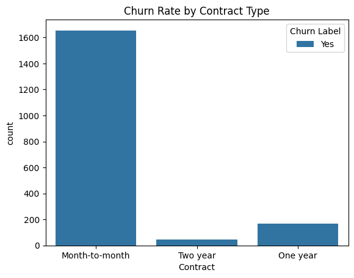
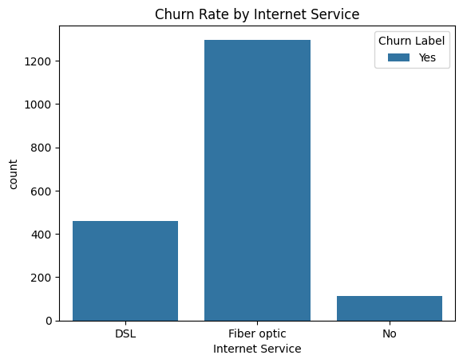
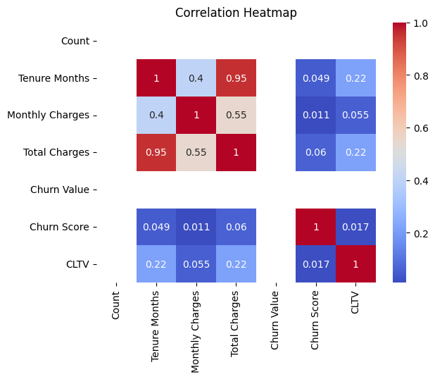
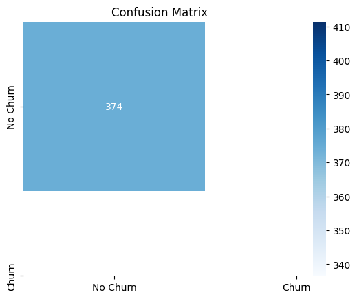

# Churn Predictor

A machine learning project that analyzes telecommunications customer data to identify factors influencing customer churn and predict customers who are likely to leave.

## 🎯 Project Objective

The goal of this project is to understand customer churn patterns and develop a predictive model that can help businesses make data-driven customer retention decisions.

## 🛠️ Technologies Used

- Python
- Pandas
- Matplotlib
- Seaborn
- Scikit-learn
- Jupyter Notebook

## 🔍 Project Workflow

1. Data Loading and Preparation
2. Exploratory Data Analysis
3. Data Visualization
4. Feature Analysis
5. Random Forest Classification
6. Model Evaluation

## 📊 Exploratory Data Analysis

### Customer Tenure Distribution

### Monthly Charges vs Churn

### Churn Rate by Contract Type

### Churn Rate by Internet Service

### Correlation Heatmap

## 🤖 Model Performance

### Confusion Matrix

## 💡 Key Takeaways

The analysis explores customer characteristics and service-related factors associated with churn. The Random Forest model is used to classify customers based on their likelihood of churn, providing insights that can support customer retention strategies.
